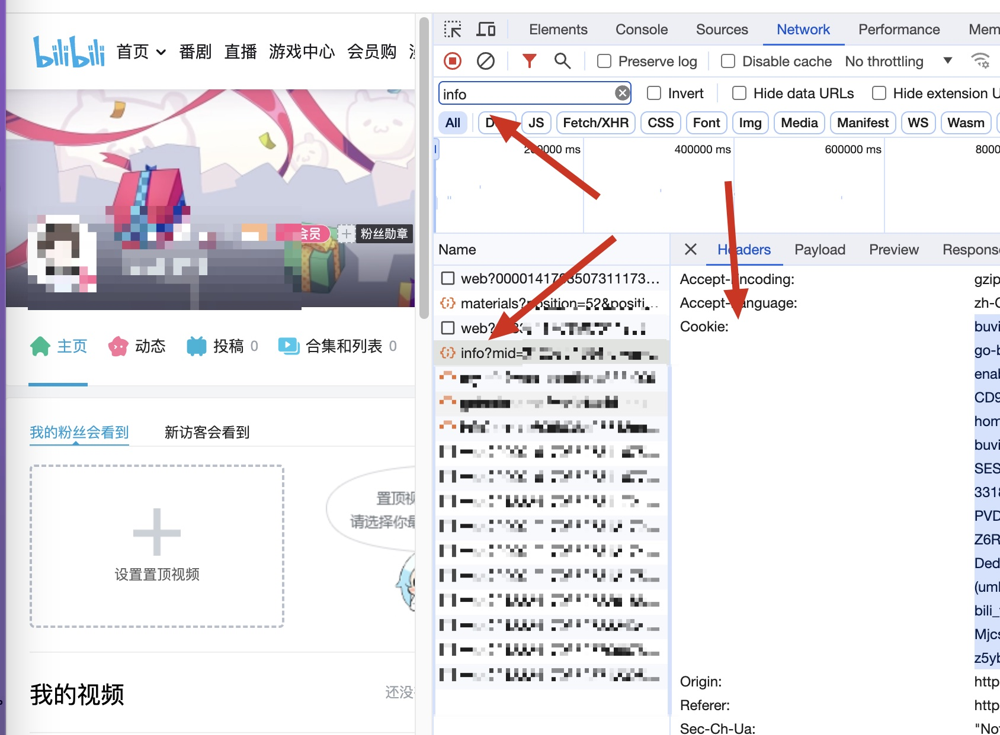
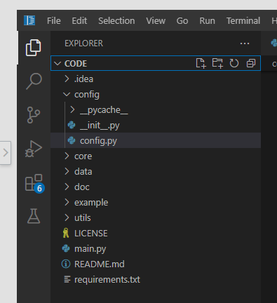
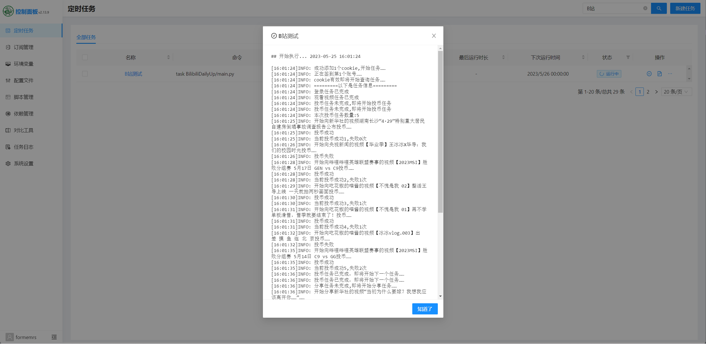
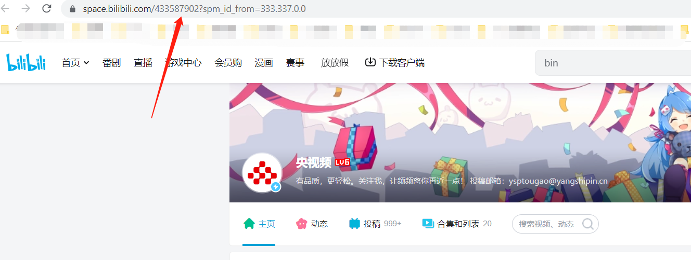

## 哔哩哔哩Bilibili升级脚本-青龙🐉/云函数☁


## 更新日志

>2023/05/25 添加了对于新的API的支持 有能力的可以自己添加功能

>2023/06/14 添加了漫画自动签到功能 增加Sever酱推送和企业微信应用推送

>2023/06/16 抽空规范了代码,期末周是真该死

>2023/11/30 修复了投币报错的问题

>2023/12/25 考研结束 将bilibili类拆分了 方便维护一点

## 功能

### 已实现功能 总计大概每天65点经验
- 每日5次投币
- 每日分享
- 每日登录
- 观看视频
- 银瓜子兑换硬币
- 添加漫画签到功能

## 使用说明

### 一、获取运行所需的 Cookies

#### 方法1（快速获取）

- 打开哔哩哔哩网页端登录好
- 新建一个浏览器页面,打开开发者模式,复制链接`https://space.bilibili.com`黏贴打开
- 复制`cookie`填入配置文件`config/config.py`的`COOKIE_LIST `变量中

### 二、部署

#### 2.1 使用 阿里云部署

目前阿里云函数调用费用很低，仅仅部署本项目一个月金额非常低，到后面会抹零头，最终支付0元。等于白嫖。

1. 登录登录[阿里云函数计算](https://account.aliyun.com/login/login.htm?oauth_callback=https%3A%2F%2Ffcnext.console.aliyun.com%2Foverview&lang=zh)支付宝扫码登录，进入函数计算控制台。创建服务

2. 在左侧菜单中选择“函数服务”，然后单击“创建函数”按钮。

3. 

4. 在“创建函数”页面中，选择“内置运行时”选项卡，然后选择“Python 3.6”作为运行环境。

5. 

6. 在“函数配置”中，输入函数名称、函数描述和函数入口，即example/tencent_cloud.main_handler。

7. 在“高级配置”中，设置执行超时时间为600秒。

8. 单击“下一步”，进入“函数代码”页面。

9. 在“函数代码”页面中，通过文件夹或者zip上传代码，注意上传完成后，根目录必须是main.py文件所在目录。

10. 单击“保存并部署”按钮，等待函数部署完成。

11. 

12. 部署完成后，您可以单击“测试”按钮来测试函数是否正常工作。

13. 如果测试通过，则可以使用函数的触发器来触发函数的执行。您可以选择阿里云定时触发器每天触发，自动执行


#### 2.2 腾讯云函数☁️

> 云函数的入口函数代码在example文件夹中
- 1.新建python3.6空白函数
- 2.在高级配置-环境配置中把初始化时间和执行超时时间改成最大!
- 3.在创建好的云函数中对着脚本里的文件新建文件复制黏贴代码!
- 4.修改配置文件`config.py`
- 5.部署运行测试
- 6.添加每日定时运行规则


#### 2.3 青龙面板🐉

> 演示机器腾讯云上海4h3g ubuntu22.04

- 1.ssh连接服务器
- 2.在青龙scripts目录下拉取代码

```bash
git clone https://github.com/Wyatt1026/BilibiliDailyUp.git
```
- 3.填写config/config.py的配置文件 或者设置环境变量`BILIBILI`
- 4.添加依赖只需要安装requests库即可
- 5.设置运行规则，运行测试
- 运行测试


## 杂项

### 1、每天对谁投币？

每天投币的up主默认固定为 新华网、人民日报、央视频 、 王冰冰、英雄联盟赛事

若需要修改则填入对于的up主UID即可。

如下图问号前面的一串数字就是UID




