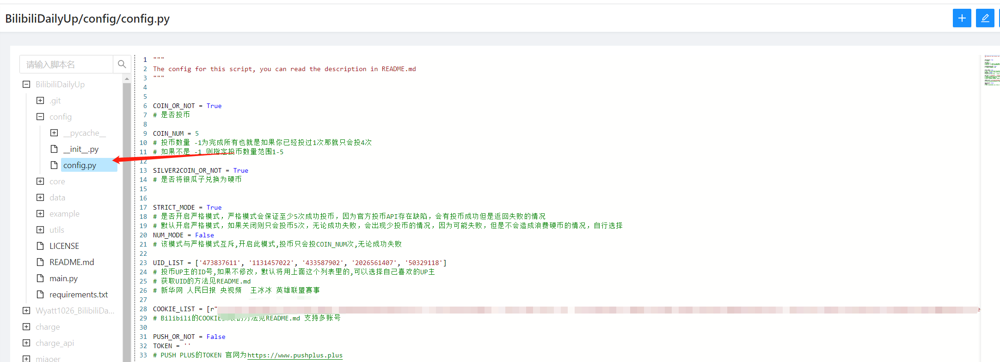
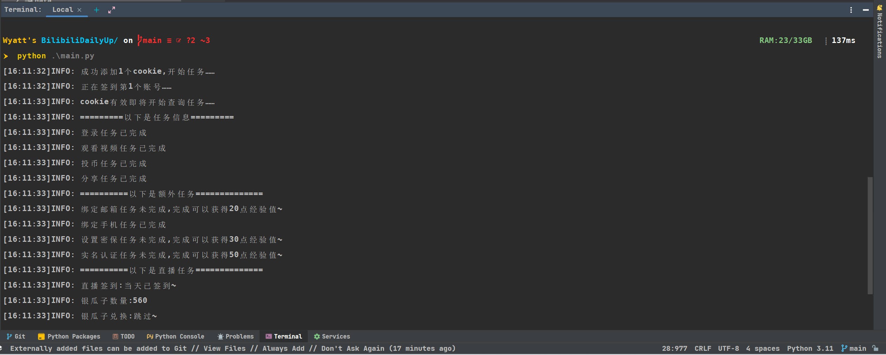

## 哔哩哔哩升级脚本-青龙🐉/云函数☁

## 前言

>于2023/5/25 添加了对于新的API的支持 有能力的可以自己添加功能

## 功能

### 已实现功能 总计大概每天65点经验
- 每日5次投币
- 每日分享
- 每日登录
- 观看视频
- 银瓜子兑换硬币
- 添加漫画签到功能

> 添加漫画签到功能,企业微信应用推送,sever酱推送

## 配置

> 配置文件是`config/config.py`文件



## 本地运行

- 安装依赖`pip3 install -r requirements.txt`
- `python3 main.py`

## 云端部署

> 阿里云函数我自己不用,理论上来说和腾讯云函数类似

### 腾讯云函数☁️
> 云函数的入口函数代码在example文件夹中
- 1.新建python3.6空白函数

- 2.在高级配置-环境配置中把初始化时间和执行超时时间改成最大!

- 3.在创建好的云函数中对着脚本里的文件新建文件复制黏贴代码!

- 4.修改配置文件`config.py`
- 5.部署运行测试
- 6.添加每日定时运行规则

### 青龙面板🐉

> 演示机器腾讯云上海4h3g ubuntu22.04

- 1.ssh连接服务器
- 2.在青龙scripts目录下拉取代码

```bash
git clone https://github.com/Wyatt1026/BilibiliDailyUp.git
```
- 3.填写config/config.py的配置文件
- 4.添加依赖只需要安装requests库即可
- 5.设置运行规则，运行测试
- 运行测试

## COOKIE抓取

- 打开哔哩哔哩网页端登录好
- 新建一个浏览器页面,打开开发者模式,复制链接`http://account.bilibili.com/site/getCoin`黏贴打开
- 复制`cookie`黏贴到脚本即可

## up主UID获取

如下图问号前面的一串数字就是UID


## 运行截图



